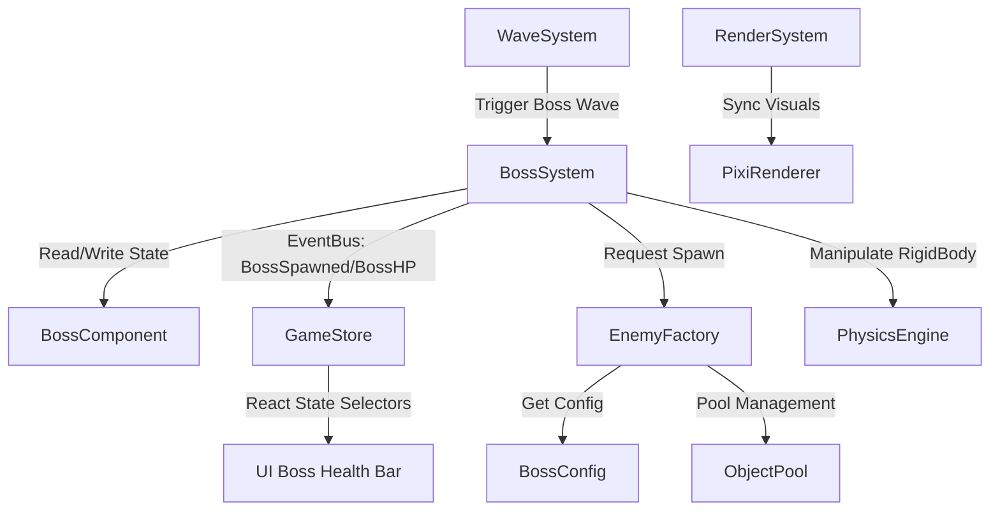

# Архитектурный и геймплейный дизайн босс-файтов (Boss Mechanics)

Этот документ описывает варианты геймплея и техническую спецификацию для интеграции механики боссов в ECS-архитектуру Tankini.

---

## 1. Геймплейные концепты (3 Варианта)

### Вариант А: «Железный Титан» (BOSS_TITAN) — Адаптивный Тяжелый Дредноут
* **Концепция:** Огромный трехбашенный сверхтяжелый танк (в 3 раза больше обычного), который адаптирует свое вооружение и броню по мере падения уровня прочности.
* **Визуальные и звуковые эффекты:**
  * Извергает густые облака черного дыма и искр (динамический эмиттер частиц).
  * При переходе между фазами от корпуса с грохотом отлетают бронепластины (спавнятся `Wreck` и металлические осколки).
  * Низкочастотный металлический скрежет двигателя (`Tone.js` синтезирует тяжелый гул гусениц и рев турбин).
* **Игровой процесс и Фазы:**
  * **Фаза 1 (100% - 60% HP) — «Артиллерийский вал»:** Медленно движется в сторону игрока, стреляя тяжелыми минометными снарядами по навесной траектории (`ArcedProjectile`). Места падения обозначаются красными маркерами (`WarningMarker`), а после взрыва образуются зоны непрерывного огня (`FireZone`), заставляя игрока постоянно маневрировать.
  * **Фаза 2 (60% - 30% HP) — «Свинцовая стена»:** Отбрасывает тяжелые орудия, скорость увеличивается на 30%. Выпускает веерные залпы быстрых самонаводящихся снарядов. Время от времени выставляет вокруг себя физические барьеры (`Wall`), закрываясь от лобовых атак.
  * **Фаза 3 (30% - 0% HP) — «Ярость Двигателя»:** Босс загорается красным пламенем (`Renderable.tint = 0xff4444`). Он прекращает стрелять стандартным оружием, активирует спаренный огнемет (`FlamerTank`) и совершает стремительные таранные рывки (`Rammer`) напрямую в игрока, оставляя за собой след выжженной земли.

### Вариант Б: «Матриарх Роя» (BOSS_HARBINGER) — Тактический Авианосец
* **Концепция:** Мобильный штабной танк-авианосец. Сам по себе слабо вооружен, но управляет полем боя, контролируя пространство с помощью дронов, мин и силовых щитов.
* **Визуальные и звуковые эффекты:**
  * Эффект левитации — парит над землей, поднимая вихри пыли под собой.
  * Защитное силовое поле вокруг босса (полупрозрачная неоновая сфера, мерцающая HSL-цветом при попадании).
  * Синтез высокочастотных «цифровых» сигналов и свиста запускающихся дронов.
* **Игровой процесс и Фазы:**
  * **Фаза 1 — «Охрана периметра»:** Орбитирует игрока на большой дистанции, периодически запуская группы из 4-6 мелких и быстрых камикадзе-дронов (`SWARMER` / `Kamikaze`), которые пытаются взять игрока в кольцо.
  * **Фаза 2 — «Энергетические пилоны»:** Босс становится полностью неуязвимым к урону (`invulnTimer = 9999`). Он спавнит на карте 2 статичных энергетических пилона (дочерние ECS-сущности), связанных с ним неоновыми лучами. Игрок должен уничтожить оба пилона, уворачиваясь от минометного обстрела, чтобы снять щит с босса.
  * **Фаза 3 — «Зачистка территории»:** Босс сбрасывает скорость и начинает хаотично засеивать карту полями активных мин (`Landmine`), сужая доступную игроку зону маневрирования до предела.

### Вариант В: «Фантомный Мираж» (BOSS_PHANTOM) — Стелс-Диверсант
* **Концепция:** Высокотехнологичный танк-невидимка, использующий голографические копии, маскировку и искривление времени для внезапных атак из засады.
* **Визуальные и звуковые эффекты:**
  * Эффекты преломления света (стеклянный/glassmorphic шейдер) и плавное изменение прозрачности (`Renderable.alpha` от 0.1 до 1.0).
  * Мерцающие синие цифровые глитч-эффекты при исчезновении.
  * Космические, «затухающие» звуковые эффекты телепортации.
* **Игровой процесс и Фазы:**
  * **Голографические проекции:** Босс уходит в полную невидимость (`Renderable.visible = 0`), сбрасывает физическое тело и создает 3 идентичные голограммы. Голограммы стреляют ложными (слабыми) снарядами. Попадание по настоящему боссу (который выдает себя легким искажением воздуха при движении) уничтожает все копии и оглушает босса на 2 секунды.
  * **Поле стазиса:** Выпускает медленную энергетическую сферу. При взрыве сфера создает купол стазиса (`StasisZone`), попав в который игрок катастрофически замедляется (скорость и скорость стрельбы снижаются на 70%), становясь легкой мишенью.
  * **Удар из Тени:** Исчезает с карты. Под игроком начинает расширяться маркер прицеливания (`WarningMarker`). Через 1.5 секунды босс материализуется в этой точке с мощным таранным ударом, нанося сокрушительный AoE-урон по площади.

---

## 2. Архитектура интеграции в ECS (bitECS + Matter.js + Pixi.js)

Чтобы строго соблюдать правила **Separation of Concerns**, **SOLID** и минимизировать нагрузку на GC, мы спроектируем систему по следующим принципам:



### 2.1 Новые ECS-Компоненты (`src/ecs/components/index.ts`)

```typescript
// Компонент идентификации босса и его текущей фазы
export const Boss = defineComponent({
  bossType: Types.ui8,         // 0: TITAN, 1: HARBINGER, 2: PHANTOM
  currentPhase: Types.ui8,     // Текущая фаза (1, 2, 3)
  phaseHPThreshold: Types.f32, // Порог здоровья для следующей фазы (в абсолютных единицах)
  actionTimer: Types.f32,      // Таймер для кулдауна спец-способностей фаз
  shieldActive: Types.ui8,     // Флаг активного силового щита (0 или 1)
});

// Компонент для хранения дочерних связей (например, пилоны босса)
export const EntityRelation = defineComponent({
  parentEid: Types.ui32,
  relationType: Types.ui8,     // 0: ShieldAnchor, 1: MirageClone
});
```

### 2.2 Новая специализированная система `BossSystem.ts`

Мы избегаем создания God-объектов. Система `BossSystem` отвечает исключительно за:
1. Отслеживание перехода по фазам здоровья босса.
2. Управление таймерами и триггерами спец-способностей (спавн пилонов, телепортация, запуск волн дронов).
3. Изменение флагов поведения босса, которые считываются существующими системами (`AISystem`, `WeaponSystem`).

Пример структуры логики `BossSystem`:
* **Фазовые переходы:**
  ```typescript
  const currentHP = Health.current[bossEid];
  if (currentHP <= Boss.phaseHPThreshold[bossEid]) {
      transitionToNextPhase(world, bossEid);
  }
  ```

### 2.3 Полное прекращение обычного спавна во время босс-волны

В `SpawnSystem.ts` мы проверяем наличие активного босса в мире bitECS:
```typescript
const bossQuery = query(world, [Boss]);
if (bossQuery.length > 0) {
    // Если босс на арене, стандартный спавн мобов отключается.
    // Спавн идет строго через логику BossSystem (эскорт/миньоны).
    return;
}
```

---

## 3. Декаплинг UI через EventBus (Separation of Concerns)

Игровая логика и рендеринг UI полностью изолированы. Общение с React-интерфейсом происходит исключительно через события:

1. **`BossSpawnedEvent(nameId, maxHp, currentHp)`**: ECS-система публикует это событие при создании босса. UIOverlay ловит его и плавно отображает (через Framer Motion) сегментированную полосу здоровья вверху экрана.
2. **`BossHealthChangedEvent(currentHp)`**: Публикуется при получении боссом урона в `CollisionSystem`. Zustand-хранилище обновляет стейт здоровья босса, на который подписан UI-компонент полосы здоровья.
3. **`BossPhaseChangedEvent(newPhase)`**: Сигнализирует UI о смене фазы (проигрывается анимация вспышки полосы здоровья, меняется цветовая схема индикатора).
4. **`BossDefeatedEvent()`**: Скрывает полосу здоровья, начисляет финальный бонус очков/валюты, возобновляет стандартный таймер волн.

---

## 4. Конфигурация без «Магических Чисел» (`src/config/BossConfig.ts`)

Все параметры (здоровье, кулдауны способностей, коэффициенты скорости для фаз) выносятся в единый файл конфигурации:

```typescript
export const BossConfig = {
  TITAN: {
    BASE_HEALTH: 5000,
    BASE_SPEED: 1.2,
    PHASES: {
      1: { hpThreshold: 0.6, speedMult: 1.0, abilityCooldown: 5.0 },
      2: { hpThreshold: 0.3, speedMult: 1.3, abilityCooldown: 4.0 },
      3: { hpThreshold: 0.0, speedMult: 1.7, abilityCooldown: 3.0 },
    },
    MORTAR_DAMAGE: 35,
    FIRE_ZONE_DURATION_SEC: 6.0,
    FIRE_ZONE_DAMAGE_PER_SEC: 10,
  },
  HARBINGER: {
    BASE_HEALTH: 3500,
    SHIELD_PYLONS_COUNT: 2,
    PYLON_HEALTH: 400,
    DRONE_SPAWN_INTERVAL: 8.0,
  },
  PHANTOM: {
    BASE_HEALTH: 3000,
    TELEPORT_COOLDOWN: 10.0,
    CLONE_COUNT: 3,
    STASIS_SLOW_MULT: 0.3,
  }
} as const;
```

---

## 5. Оптимизация памяти (Object Pooling)

Для предотвращения падения FPS из-за сборщика мусора (Garbage Collector):
* Все снаряды босса (мины, сферы стазиса, ракеты), частицы дыма/огня и дочерние сущности (пилоны, дроны) берутся из существующего `ObjectPool` проекта.
* Координаты и физические тела переиспользуются через пул жестких тел в `PhysicsEngine`.

---

## 6. Фактическая техническая реализация (Actual Implementation Details)

Механика босс-файта полностью реализована, протестирована и интегрирована в основное ядро игры в строгом соответствии с принципами ECS и SOLID.

### 6.1 Логика поведения босса (`src/ecs/systems/BossSystem.ts`)
Разработана и подключена изолированная система `BossSystem`, которая управляет поведением **Железного Титана** (`EnemyType.BOSS_TITAN`) в зависимости от уровня его прочности:
* **Фаза 1 (100% - 60% HP):** Босс медленно преследует игрока. Каждые `MORTAR_COOLDOWN_SEC` секунд он запускает артиллерийский залп из 3-х тяжелых минометов по области вокруг игрока, создавая маркеры предупреждения (`WarningMarker` типа `0`).
* **Фаза 2 (60% - 30% HP):** Скорость движения увеличивается на 30% (`PHASE2_SPEED_MULT`). Раз в `BURST_COOLDOWN_SEC` секунд босс выпускает веерный залп из 8 быстрых снарядов во фронтальной полусфере. На фазовом переходе спавнятся 4 эскорт-минора типа `ENEMY_RAMMER` для круговой обороны.
* **Фаза 3 (< 30% HP):** Босс активирует таранный режим. Каждые `RAM_COOLDOWN_SEC` секунд он выполняет высокоскоростной бросок напрямую на позицию игрока с ускорением в 3 раза (`PHASE3_RAM_SPEED_MULT`). Движение сопровождается сильной тряской экрана и визуальным комикс-эффектом `WHOOSH`. На переходе спавнится дополнительная волна миньонов.
* **Сочные фазовые переходы:** При переходе между фазами активируется кратковременное замедление времени (эффект Time Dilation `context.setTimeScale(0.3, 1.0)`), проигрывается взрыв на корпусе босса, срабатывает сильная тряска камеры (`context.addCameraShake(35)`) и вылетает визуальный комикс-эффект `TIER_UP`.

### 6.2 Заморозка прогресса и спавна (`WaveSystem.ts` и `SpawnSystem.ts`)
* **Wave Timer Lock:** `WaveSystem` блокирует обратный отсчет таймера волны до тех пор, пока на поле боя присутствует сущность с компонентом `Boss`. Таймер возобновляет ход сразу после уничтожения босса.
* **Spawn Throttling:** При обнаружении живой сущности с компонентом `Boss` в `SpawnSystem`, стандартный спавн рядовых мобов полностью отключается. Дополнительные враги создаются исключительно самой `BossSystem` в качестве механики фазовых подкреплений.
* **Триггер появления:** Босс автоматически спавнится раз в 3 волны (когда `currentWave % 3 === 0`) на границе видимости игрока.

### 6.3 Декаплинг событий и Zustand HUD (`UIOverlay.tsx`)
Взаимодействие слоев полностью развязано через события и Zustand:
1. **События (`src/models/events.ts`):** `BossSpawnedEvent`, `BossHealthChangedEvent`, `BossPhaseChangedEvent`, `BossDefeatedEvent` публикуются из ECS-мира при соответствующих геймплейных триггерах (получение урона в `CollisionSystem`, фазовые изменения в `BossSystem`).
2. **Обновление хранилища (`src/stores/GameStore.ts`):** Zustand-стор подписывается на события шины и реактивно меняет состояние (`bossActive`, `bossHealth`, `bossPhase`, `bossNameKey`).
3. **Изолированный UI-компонент (`BossHealthBar`):**
   * Создан специализированный React-компонент, который использует `useShallow` для точечной подписки на состояние босса, предотвращая лишние перерисовки остального интерфейса.
   * Оформлен в комиксном стиле: скошенные грани, жесткая черная 6px рамка и тень со сдвигом 8px.
   * Цветовое кодирование фаз: фаза 1 — пульсирующий радиоактивный зеленый (`bg-green-500`), фаза 2 — предупреждающий желто-оранжевый перегрев (`bg-yellow-500`), фаза 3 — критический аварийный красный (`bg-red-600` c анимацией `animate-bounce`).
   * Поддерживает локализованные строковые ключи из `src/localization/en.ts`.

### 6.4 Процедурный рендеринг (`SpriteBuilder.ts`)
Метод `drawBossTitan` отрисовывает исполинскую военную платформу:
* Двойные параллельные гусеницы с каждой стороны (всего 4 трака) темно-серого цвета.
* Огромный тяжелый бронекорпус стального цвета с ядерно-зелеными линиями подсветки.
* Две параллельные артиллерийские башни на поворотной турели, которые автоматически вращаются в сторону игрока с помощью стандартной системы наведения `Weapon.aimAngle`.
* Массивный таранный отвал-плуг на носу танка.
* Выхлопные трубы в кормовой части.
* Пульсирующий реакторный сердечник в центре турели и спаренные красные прожекторы-глаза.
